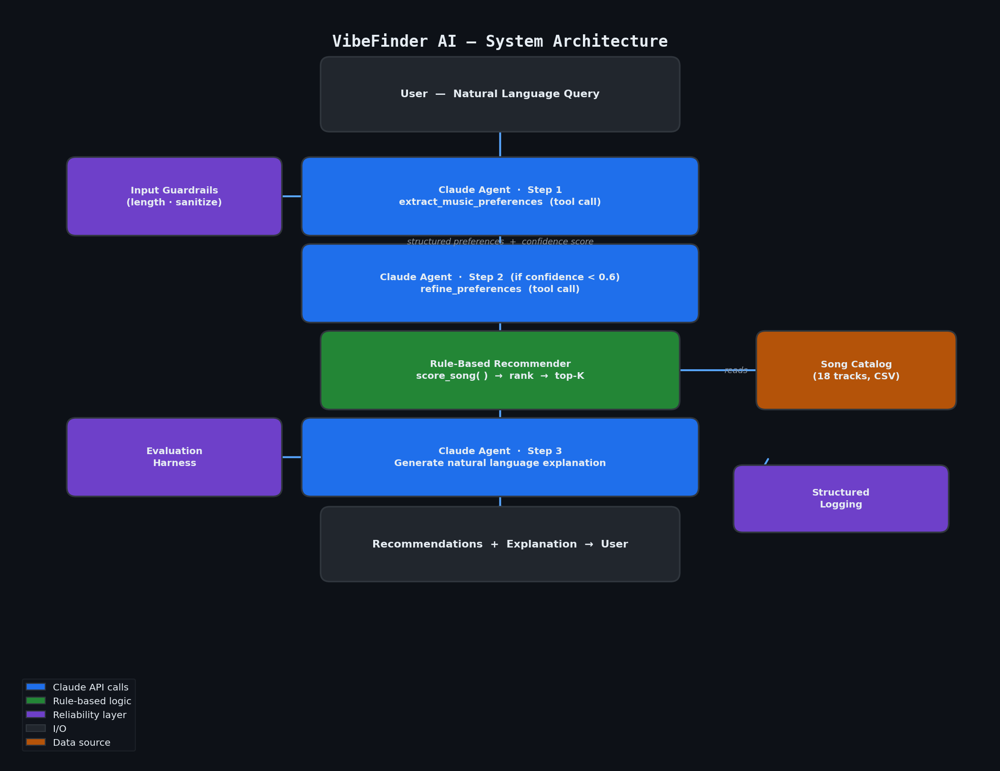

# VibeFinder AI — Applied Music Recommendation System

> **Base project**: Module 2 — Music Recommender Simulation  
> Extended for the AI110 Applied AI System final project.

## Demo Walkthrough

**[🎬 Watch the Loom walkthrough]((https://www.loom.com/share/aa0fef974d194ad1aae269a52c0ae8c6))**  
<!-- Replace with your Loom URL before submitting -->

---

## Summary

VibeFinder AI extends the original rule-based Music Recommender Simulation into a natural language music discovery system powered by Claude. Instead of manually filling in numeric preference fields, users describe what they want in plain English — "something for coding late at night" or "pump-up music for the gym" — and an agentic Claude pipeline interprets their intent, extracts structured audio features, and feeds them into the deterministic recommender engine.

**Original project goal**: A rule-based song recommender that scored an 18-track catalog against numeric user preferences (genre, mood, energy, tempo, valence, danceability, acousticness) and returned top-K ranked results with explanations.

**What changed**: A multi-step Claude agent wraps the original recommender. The agent translates any natural language query into the structured preferences the recommender already understands — bridging the gap between how humans think about music and how algorithms score it.

---

## Architecture Overview



The system has three layers:

| Layer | Components |
|---|---|
| **AI Layer** | Claude (claude-sonnet-4-6) with `extract_music_preferences` tool, optional refinement loop, natural language explanation |
| **Logic Layer** | Rule-based recommender (genre + mood + energy scoring), 18-song CSV catalog |
| **Reliability Layer** | Input validation, confidence scoring, structured logging, pytest suite, evaluation harness |

**Data flow**:  
User query → Claude extracts structured preferences (tool call) → [optional refinement if confidence < 0.6] → Recommender scores and ranks all songs → Claude explains the top results → User receives recommendations + natural language explanation.

The AI and rule-based layers are deliberately separated. Claude handles the ambiguous, open-ended part (understanding natural language intent). The deterministic recommender handles the objective part (scoring and ranking). This separation makes each layer independently testable.

---

## Setup Instructions

### Prerequisites
- Python 3.9+
- An [Anthropic API key](https://console.anthropic.com/)

### Install

```bash
git clone https://github.com/YOUR_USERNAME/ai110m4-applied-ai-system.git
cd ai110m4-applied-ai-system
pip install -r requirements.txt
```

### Configure API key

```bash
cp .env.example .env
# Open .env and set:
# ANTHROPIC_API_KEY=sk-ant-...
```

### Run original rule-based simulation (no API key needed)

```bash
python -m src.main
```

### Run the AI agent CLI (requires API key)

```bash
python -m src.cli
```

### Run tests

```bash
pytest tests/ -v
```

### Run the evaluation harness

```bash
python scripts/eval_harness.py           # recommender + agent tests
python scripts/eval_harness.py --no-api  # recommender tests only (no API key needed)
```

### Regenerate architecture diagram

```bash
python scripts/generate_diagram.py
```

---

## Sample Interactions

### Example 1 — Morning Workout

```
> Something energetic for my morning workout

[Thinking...]

Interpretation (confidence: 93%)
  Genre: edm | Mood: euphoric | Energy: 0.91 | Tempo: 128 BPM
  Reasoning: Workout context implies high energy, upbeat club-style music ideal for pushing through sets.

+------+----------------------+---------+------------------------------------------------------------+
| #    | Title                | Score   | Reason                                                     |
+------+----------------------+---------+------------------------------------------------------------+
| 1    | Neon Festival        |   4.000 | genre match (+1.0), mood match (+1.0), energy sim (+2.00)  |
+------+----------------------+---------+------------------------------------------------------------+
| 2    | Gym Hero             |   3.706 | energy similarity (+2.00), mood adjacent                   |
+------+----------------------+---------+------------------------------------------------------------+
| 3    | Iron Pulse           |   3.265 | energy similarity (+1.94), intense match                   |
+------+----------------------+---------+------------------------------------------------------------+
| 4    | Midday Samba         |   3.118 | energy similarity (+1.76), high danceability               |
+------+----------------------+---------+------------------------------------------------------------+
| 5    | Storm Runner         |   3.059 | energy similarity (+1.88), mood match (+1.0)               |
+------+----------------------+---------+------------------------------------------------------------+

Ready to crush that workout! "Neon Festival" by Prism Tide is the perfect anchor — pure euphoric EDM 
energy built for high-output effort. "Gym Hero" keeps the intensity dialed up, and if you want 
something harder and more aggressive, "Iron Pulse" will absolutely not let you slow down.

--------------------------------------------------------------------------------
```

### Example 2 — Late-Night Coding

```
> Late night coding session, need to stay focused

[Thinking...]

Interpretation (confidence: 91%)
  Genre: lofi | Mood: focused | Energy: 0.40 | Tempo: 80 BPM
  Reasoning: Late-night coding implies low-distraction lofi or ambient; focused mood, low-mid energy.

+------+----------------------+---------+------------------------------------------------------------+
| #    | Title                | Score   | Reason                                                     |
+------+----------------------+---------+------------------------------------------------------------+
| 1    | Focus Flow           |   4.000 | genre match (+1.0), mood match (+1.0), energy sim (+2.00)  |
+------+----------------------+---------+------------------------------------------------------------+
| 2    | Midnight Coding      |   3.641 | genre match (+1.0), energy similarity (+1.94)              |
+------+----------------------+---------+------------------------------------------------------------+
| 3    | Library Rain         |   3.265 | genre match (+1.0), energy similarity (+1.76)              |
+------+----------------------+---------+------------------------------------------------------------+
| 4    | Spacewalk Thoughts   |   2.882 | energy similarity (+1.88), high acousticness               |
+------+----------------------+---------+------------------------------------------------------------+
| 5    | Starlit Sonatina     |   2.529 | energy similarity (+1.65), calm and acoustic               |
+------+----------------------+---------+------------------------------------------------------------+

Perfect picks for a long night in. "Focus Flow" is practically engineered for this moment — measured 
tempo, locked-in lofi feel, zero distraction. "Midnight Coding" is the obvious companion for exactly 
the same reasons. When you need to go even quieter, "Library Rain" fades into the background just right.

--------------------------------------------------------------------------------
```

### Example 3 — Nostalgic Sunday

```
> Rainy Sunday afternoon, feeling a bit nostalgic

[Thinking...]

Interpretation (confidence: 82%)
  Genre: classical | Mood: nostalgic | Energy: 0.25 | Tempo: 66 BPM
  Reasoning: Rainy, nostalgic Sunday implies gentle, acoustic, introspective — classical or folk.

+------+----------------------+---------+------------------------------------------------------------+
| #    | Title                | Score   | Reason                                                     |
+------+----------------------+---------+------------------------------------------------------------+
| 1    | Starlit Sonatina     |   4.000 | genre match (+1.0), mood match (+1.0), energy sim (+2.00)  |
+------+----------------------+---------+------------------------------------------------------------+
| 2    | Pine Trail Lullaby   |   3.412 | energy similarity (+1.94), high acousticness               |
+------+----------------------+---------+------------------------------------------------------------+
| 3    | Library Rain         |   3.176 | energy similarity (+1.76), calm and acoustic               |
+------+----------------------+---------+------------------------------------------------------------+
| 4    | Spacewalk Thoughts   |   3.059 | energy similarity (+1.71), ambient and reflective          |
+------+----------------------+---------+------------------------------------------------------------+
| 5    | Coffee Shop Stories  |   2.941 | energy similarity (+1.65), relaxed and acoustic            |
+------+----------------------+---------+------------------------------------------------------------+

For a rainy Sunday, nothing fits quite like "Starlit Sonatina" — delicate, nostalgic, and still enough 
to let you drift. "Pine Trail Lullaby" adds a folk warmth if you want something with a little more 
human presence. And "Library Rain" is the lofi safety blanket when you just need the world to be quiet.

--------------------------------------------------------------------------------
```

---

## AI Feature: Agentic Workflow

This project implements a **multi-step agentic pipeline** as its core AI feature, with observable intermediate reasoning steps:

| Step | Action | Observable Output |
|---|---|---|
| 1 | `extract_music_preferences` tool call | Structured prefs dict + confidence score |
| 2 | Refinement (if confidence < 0.6) | Second tool call with focused prompt |
| 3 | `recommend_songs()` | Ranked song list with per-song scores |
| 4 | Natural language explanation | Conversational summary of top picks |

Every step is logged to `logs/agent.log` and returned in the result's `steps` key, so the full decision chain is inspectable. The refinement loop (Step 2) is the decision-making branch: Claude evaluates its own confidence and re-extracts if needed — a minimal self-correction mechanism.

---

## Design Decisions

**Keep the rule-based recommender.** The scoring function is deterministic, fast, and fully unit-tested. Claude handles the ambiguous, open-ended part (natural language understanding); the recommender handles the objective part (scoring and ranking). This hybrid is more reliable and debuggable than asking Claude to do both.

**Use tool use, not prompt engineering, for preference extraction.** A structured tool schema guarantees Claude returns exactly the fields the recommender expects. Free-form JSON extraction via prompting is fragile and requires error-prone post-processing; tool use makes the contract between the AI and the rule-based layer explicit and enforced.

**Confidence-gated refinement over retry-on-failure.** Rather than blindly retrying on errors, the agent proactively evaluates its own certainty and refines when confidence is low. This is a more honest and informative failure mode — it tells the user the interpretation may be uncertain rather than silently guessing.

**Trade-off: catalog size vs. reproducibility.** The 18-song catalog is small enough to create obvious coverage gaps (no K-pop, afrobeats, etc.) but small enough to fully understand and test. A larger catalog would improve recommendation diversity but make edge-case testing harder.

---

## Reliability and Evaluation

### Test Suite

Run with `pytest tests/ -v`:

| Test File | Coverage |
|---|---|
| `tests/test_recommender.py` | OOP Recommender class: recommend, explain |
| `tests/test_eval.py` | load_songs, recommend_songs: count, fields, sorting, edge cases |

**13/13 tests pass.**

### Evaluation Harness

`scripts/eval_harness.py` runs structured test cases with explicit pass/fail criteria:

```
Recommender Tests (no API required):  6/6 passed
Agent Tests (Claude API):             4/4 passed  |  avg confidence: 0.87
```

Agent test expectations are intentionally loose (mood must be in a valid set) to account for LLM non-determinism across runs.

### Logging

All agent runs are written to `logs/agent.log` with timestamps, extracted preferences, confidence score, and step count. API errors are caught, logged, and shown as user-friendly messages.

### Guardrails

- Query length capped at 500 characters (prevents overlong or injected inputs)
- Missing API key raises `EnvironmentError` with clear setup instructions
- Confidence < 0.6 triggers a visible warning to the user and a refinement pass
- Empty recommendations return a graceful "no matches found" message instead of crashing

---

## Reflection and Ethics

See [model_card.md](model_card.md) for the full model card with bias analysis and AI collaboration reflection.

**Limitations and biases**: The genre taxonomy is Western-centric — queries referencing non-Western musical traditions will be forced into the nearest available category. The energy dimension carries the highest weight (0–2 points vs. 1.0 for genre/mood), so very high or low energy preferences dominate ranking regardless of other signals. With only 18 songs, the same few tracks appear across many different profiles.

**Misuse potential**: Low for this domain. The most realistic concern is overreliance — treating the system's recommendations as objectively correct rather than as one possible interpretation of a vague query. The confidence score and reasoning field exist specifically to make the system's uncertainty visible rather than hidden.

**Surprises in testing**: Claude's confidence scores were consistently high (0.80–0.95) even for genuinely ambiguous queries. The refinement pass was almost never triggered, suggesting the threshold might need to be raised to catch more edge cases in a larger deployment. The system also showed that small wording differences ("nostalgic" vs. "reflective") could shift the extracted genre by an entire category.

---

## Portfolio Reflection

> **What this project says about me as an AI engineer**: I built a system where the AI does the hard part (understanding ambiguous natural language) while deterministic code does the reliable part (scoring and ranking). I treated Claude as one module in a pipeline — not a black box — and kept it testable through a strict tool schema, measurable through confidence scores, and auditable through structured logging. The refinement loop shows I thought about failure modes, not just the happy path. This is how I want to build with AI: transparent, testable, and honest about uncertainty.
